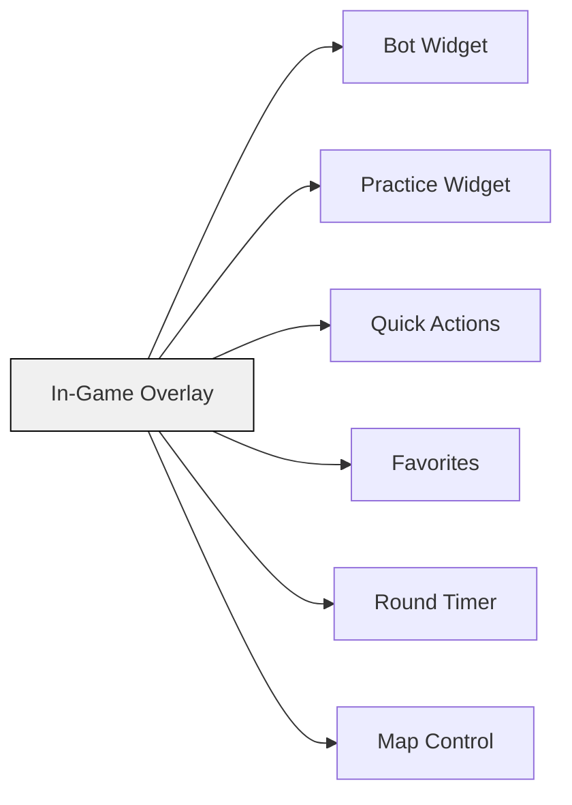

# Executive Summary

This prompt outlines the design and implementation of **“CS:GO Config Manager”**, a professional Windows 11 desktop application for **CS:GO Legacy (1.38.x)** only.  The app will provide a fully **data-driven GUI** for *every* editable CS:GO console command and configuration setting. It will include mode-specific configuration editors, profile and backup management, and an integrated launcher center (supporting Steam, 7Launcher, direct `csgo.exe`, or a custom executable). An optional in-game overlay (a transparent, non-injective Windows overlay) will allow real-time control (e.g. bots, practice cheats, quick commands).  The plan below details goals, scope, technology stack, folder layout, data schemas, UI pages with exact features, overlay design, conflict detection behavior, command metadata and validation, backup/restore logic, launch workflows, detection heuristics, security constraints, testing criteria, MVP milestones, deliverables, and recommended reference sources. It also includes tables (folder layout, JSON schema example, UI feature matrix, milestone timeline) and Mermaid diagrams (app architecture and overlay widgets). This is a **comprehensive blueprint** for an autonomous agent to execute.  

## Goals & Scope

- **Focus on CS:GO Legacy (1.38.x)** only for version 1.0.  Do *not* add support for other games yet. All features should work with CS:GO’s multiple config files (autoexec.cfg, gamemode_casual.cfg, etc.) and console commands.  
- Provide **full GUI coverage** of all meaningful CS:GO settings: every ConVar or command that a user might want to change should have a graphical control. (Users should almost never need to type a console command manually.)  
- Support **game-mode-specific configs** (Casual, Competitive, Deathmatch, Arms Race, Demolition, Custom/Practice) with separate editors. Show how each mode’s .cfg files override common settings.  
- Include **profiles and presets** so users can save and apply entire setups (e.g. “Practice”, “1v1”, “Aim Training”).  
- Provide robust **backup and restore** functionality (automatic and manual).  
- Integrate a **launch center** to start CS:GO via Steam, 7Launcher, or directly (with optional admin mode and custom parameters).  
- (Optional) Offer a **custom overlay** feature: a floating widget-based control panel that appears over the game for practice/bot commands. This overlay must be non-intrusive (no code injection) and user-customizable.  

**Key constraints:** No Steam emulation or API bypass (no attempt to subvert Steam licensing). No unauthorized modification of the game. Overlay must not hook or inject into the game process (see security below).  

## Platform & Technology Choices

- **Target:** Windows 11 (64-bit). The app should be fast and lightweight (usable on low-end laptops).  
- **Language:** C#.NET.  
- **UI Framework:** WPF (Windows Presentation Foundation) is recommended for a modern, responsive GUI. (Optionally WinForms could be used, but WPF provides better layout, styling, and support for docking widgets.) We will assume WPF.  
- **.NET Version:** .NET 6+ (for broad support).  
- **Data-Driven Design:** All command and ConVar metadata will be loaded from JSON files (not hardcoded). This allows easy updates and community contributions.  
- **Application Type:** Portable folder-based app (no installer). The output will be a directory containing `CSGOConfigManager.exe`, data files, and subfolders. Users can move or delete the folder without installation.  

## Folder & File Layout

Use a clear, portable folder structure. For example:

| **Path**                   | **Contents / Purpose**                                                 |
|----------------------------|------------------------------------------------------------------------|
| `CSGOConfigManager.exe`    | Main executable                                                        |
| **Data/**                  | Read-only JSON data files for commands and settings                    |
| &nbsp;&nbsp;`Commands.json`     | List of all CS:GO commands/ConVars with metadata and defaults         |
| &nbsp;&nbsp;`ConVars.json`      | (Optional) Detailed console variable listings (if separate)           |
| &nbsp;&nbsp;`GameModes.json`    | Definitions of game mode config files (e.g. Casual → gamemode_casual.cfg) |
| &nbsp;&nbsp;`Defaults.json`     | Fallback default values for commands (if needed)                     |
| &nbsp;&nbsp;`Ranges.json`       | Numeric ranges or allowed values for commands (if not in Commands.json) |
| &nbsp;&nbsp;`Tooltips.json`     | Localized descriptions/tooltips for commands                          |
| &nbsp;&nbsp;`Launchers.json`    | Info on supported launch methods (Steam, 7Launcher, EXE, custom)      |
| &nbsp;&nbsp;`Presets/`          | Preset profiles (e.g. `Casual.json`, `Competitive.json`) for quick apply |
| &nbsp;&nbsp;`Layouts/`          | (Optional) Overlay layout presets or UI themes                        |
| **Config/**                | User-specific settings (path overrides, preferences)                   |
| &nbsp;&nbsp;`Settings.json`     | User preferences (steam path, theme, etc.)                           |
| &nbsp;&nbsp;`Profiles/`         | Saved config profiles (sets of values and which files to edit)        |
| **Backups/**               | Auto and manual backups of CS:GO config files                          |
| **Logs/**                  | Application logs (errors, actions)                                     |
| **Themes/**                | UI theme files or styles (e.g. dark/light mode)                        |
| **Plugins/**               | (Optional) Folder for future extensions or community plugins           |

Each folder and file must have clear purposes (backup all files before edit, provide versioning, etc.).  

## JSON Data Schemas (Example)

All editable commands will be defined in **data JSON files** so the UI can be generated dynamically.  For example, `Commands.json` might contain entries like the one below. Each entry describes a console command or ConVar:

```json
{
  "name": "bot_quota",
  "type": "integer",
  "default": 10,
  "min": 0,
  "max": 20,
  "description": "Total number of bots to maintain on the server.",
  "category": "Bots",
  "requires_restart": false,
  "requires_sv_cheats": false,
  "mode": ["casual", "competitive", "deathmatch", "custom"],
  "file": "gamemode_casual.cfg"
}
```

The fields for each command include:

- `name` (string): The exact console command/ConVar name (e.g. `"bot_quota"`).  
- `type` (string): Data type (`"integer"`, `"boolean"`, `"float"`, `"string"`, `"enum"`, etc.).  
- `default` (number/string/bool): Default value.  
- `min`, `max` (number): Allowed numeric range (if applicable).  
- `enum` (list of strings): Allowed values (if type is `"enum"` or `"dropdown"`).  
- `description` (string): Tooltip or help text for the setting.  
- `category` (string): High-level grouping (e.g. `"Bots"`, `"Gameplay"`, `"Audio"`, etc.).  
- `requires_restart` (bool): Whether changing it needs map/game restart.  
- `requires_sv_cheats` (bool): Whether `sv_cheats` must be enabled to set it.  
- `mode` (list of strings): Game modes where this setting applies (e.g. `["casual","competitive"]`).  
- `file` (string): The default config file it belongs to (e.g. `gamemode_casual.cfg`).  
- (Optional) Other fields: `hidden` (bool) for dev commands, `convar` (bool) to mark if it’s a ConVar vs pure command, etc.  

Repeat similar JSON schemas for other data files:

- **ConVars.json**: If separate, list ConVars with their help, min/max, etc.  
- **GameModes.json**: Maps game mode names to config file names, e.g.:  
  ```json
  {
    "Casual":   "gamemode_casual.cfg",
    "Competitive": "gamemode_competitive.cfg",
    "Deathmatch": "gamemode_deathmatch.cfg",
    "ArmsRace": "gamemode_armsrace.cfg",
    "Demolition": "gamemode_demolition.cfg",
    "Custom":   "practice.cfg"
  }
  ```  
- **Defaults.json**: (Optional) Provide default values for all commands (could duplicate `default` above or cover missing ones).  
- **Ranges.json**: (Optional) Numeric ranges for commands (if not embedded in `Commands.json`).  
- **Tooltips.json**: Human-readable descriptions keyed by command name, for UI tooltips.  
- **Launchers.json**: Defines how to launch via different methods, e.g.:  
  ```json
  {
    "steam":   { "name": "Steam",   "exe": "steam.exe",    "args": "steam://rungameid/730" },
    "7launcher": { "name": "7Launcher", "exe": "7launcher.exe", "args": "--run csgo" },
    "exe":     { "name": "CSGO Executable", "exe": "csgo.exe", "args": "" },
    "custom":  { "name": "Custom",  "exe": "",          "args": "" }
  }
  ```  

- **Presets/**: Each JSON file here defines a profile (set of command-value pairs) to apply to one or more config files.  
- **Layouts/** (Optional): JSON layouts for the overlay/widget positions (if saving user layouts).  

A **JSON schema example table** (for one `Commands.json` entry) could be:

| **Field**         | **Type**    | **Example**                             |
|-------------------|-------------|-----------------------------------------|
| `name`            | string      | `"bot_quota"`                           |
| `type`            | string      | `"integer"`                             |
| `default`         | integer     | `10`                                    |
| `min`             | integer     | `0`                                     |
| `max`             | integer     | `20`                                    |
| `description`     | string      | `"Number of bots to maintain."`         |
| `category`        | string      | `"Bots"`                                |
| `requires_restart`| boolean     | `false`                                 |
| `requires_sv_cheats`| boolean   | `false`                                 |
| `mode`            | array       | `["casual","competitive"]`              |
| `file`            | string      | `"gamemode_casual.cfg"`                 |

Ensure that any commands not explicitly listed have sensible defaults or are omitted. The UI code should dynamically read these JSON files on startup so adding a new command only requires updating the JSON, not recompiling code.

## UI Pages & Features

The app will have multiple UI pages (or tabs) with specific functions. Below is a high-level feature matrix:

| **Page**                | **Key Features / Controls**                                                    |
|-------------------------|--------------------------------------------------------------------------------|
| **Home / Dashboard**    | - Detect Steam and CS:GO Legacy installation (registry or default paths).<br>- Show game version and active profile.<br>- Indicate detection of Steam, 7Launcher, etc.<br>- Quick-launch buttons: Launch via Steam, 7Launcher, Direct EXE, Offline mode.<br>- Quick-access buttons: Open Game Folder, Config Folder, `userdata`, Workshop, Screenshots, etc.<br>- Status indicators (e.g. “Config up-to-date”).<br>- `[▶ Launch Game]` big button. |
| **Launch Center**       | - Choose launch method (radio or dropdown: Steam, 7Launcher, EXE, Custom).<br>- Fields to specify custom parameters (map name, launch options, offline flag).<br>- Buttons: “Launch with profile” (applies selected profile then starts game), “Launch Offline”, “Test Path”.<br>- Save default launch method in Settings. |
| **Game Modes Editor**   | One page or tab per mode (Casual, Competitive, Deathmatch, Arms Race, Demolition, Practice/Custom):<br>- List all commands relevant to that mode (pulled from `Commands.json` filtered by `mode`).<br>- Grouped sections: e.g. Bots, Economy, Teams, Rounds, Respawn, Buy settings, etc.<br>- Controls for each setting (see below).<br>- Show “default vs current” values and explanation.|
| **Bot Manager**         | Dedicated page for bot commands:<br>- Controls for `bot_quota` (slider or numeric), `bot_quota_mode` (dropdown), `bot_join_team` (radio), `bot_difficulty` (dropdown), etc.<br>- Buttons: “Add Bot (T)”, “Add Bot (CT)”, “Kick All Bots”.<br>- Preset buttons: e.g. “T-only Bots”, “CT-only Bots”, “5 Bots”, “10 Bots”.<br>- Display effective bot count, and warn if overridden by current mode.<br>- Show current bot difficulty.|
| **Practice Settings**   | Toggles and controls for practice/server cheats:<br>- Checkboxes: Infinite Ammo, Infinite Zoom, Grenade Trajectory, Bullet Impacts, God Mode, No Clip, Freeze Time, Infinite Money, Buy Anywhere, etc.<br>- Numeric controls: Warmup time, Round restart time, etc.<br>- Friendly Fire toggle, auto-restart on death, show damage markers, etc.<br>- These correspond to console commands (sv_cheats, mp_roundtime, etc.).|
| **Command Browser**     | A searchable/browsable database of **all commands** (from JSON):<br>- Table or list with columns: *Command Name*, *Category*, *Default*, *Current*, *Allowed Range/Values*, *Type*, *Requires Restart*, *Needs Cheats*, *Description*.<br>- Search and filter by name, description, category, mode, file, etc.<br>- Selecting a command shows details in a pane (with description and tooltip) and an edit control (like above) to change its value in the active profile or config.|
| **Config File Editor**  | Text editor for raw `.cfg` files:<br>- Open and edit: `autoexec.cfg`, `config.cfg`, each `gamemode_*.cfg`, `practice.cfg`, etc.<br>- Syntax highlighting for console commands (if feasible).<br>- Line numbers, search/replace, undo/redo.<br>- Buttons: Save, Restore from backup, Show Diff against backup.<br>- Validate syntax on save (warn on invalid commands).<br>- Automatically backup before overwriting (keeps old version in `Backups/`).|
| **Profiles Manager**    | Create and manage profiles:<br>- List of saved profiles (e.g. Practice, 1v1, CompetitiveOffline, etc.).<br>- Each profile defines values for multiple settings across modes (or even selected launch options).<br>- Buttons: New, Save, Rename, Delete profile.<br>- Apply Profile: sets all related settings in config files and autoexec.<br>- Export/Import profile JSON. |
| **Backups**             | Manage backups of configs:<br>- List of backups (with timestamp or name).<br>- Buttons: Restore backup, Delete backup, Export backup file.<br>- Option to create a manual backup on demand.<br>- Compare: show diff between current config and backup (highlight changed lines).|
| **Overlay Designer**    | (If overlay enabled) Design in-game widgets:<br>- Drag-and-drop widgets onto a canvas (world/viewport or screen overlay).<br>- Available widgets: Bot Widget, Practice Widget, Quick Actions, Favorites, Timer, etc. (see below).<br>- Controls for each widget: position, size, color, opacity, hotkey binding.<br>- Save multiple **layouts** (e.g. “Practice”, “Aim Training”).<br>- Toggle overlay on/off with a global hotkey.|
| **Settings**            | Application preferences:<br>- Steam path (auto-detected via registry or browse).<br>- CS:GO path (if separate from Steam).<br>- 7Launcher path.<br>- Default launch method.<br>- Auto-backup on change (bool).<br>- UI theme (dark/light/custom).<br>- Language selection (if multi-lingual support).<br>- Paths to folders (config, userdata, etc.), with “Open Folder” buttons.<br>- Check for updates (if applicable).|

Each page should have a consistent layout (e.g. sidebar navigation or tabs) and a search field at top if appropriate.  Controls should have tooltips from `Tooltips.json` explaining each setting.

## Controls & Data Binding

All settings in the UI must use appropriate controls for their data type:

- **Boolean (0/1)**: Toggle switch or checkbox (e.g. “Enable Cheats”).  
- **Integer/Float**: Numeric up-down or slider with step and range. Display value and units (if any).  
- **Enum/Text**: Dropdown or radio buttons (e.g. bot_difficulty levels, bot_quota_mode options).  
- **Color**: Color picker (for any color-related setting, e.g. HUD colors).  
- **Key Bind**: A text box that captures a key press (for rebindable keys).  
- **Actions (no value)**: Button (e.g. `bot_kick` as “Kick All Bots”).  

Each control should show: current value, default value (grayed), min/max or allowed values. If the current value differs from default, highlight the change. If a setting is locked by mode or requires a restart/cheats, indicate that (icon or tooltip).  

Controls should **enforce validation**: for example, do not allow typing `-5` if min is 0, or numbers beyond max.  Display warnings if a value is out of range or if two settings conflict.  

## In-Game Overlay (Widget System)

*(Optional feature)* Provide an **in-game overlay** – a set of floating widgets drawn over the CS:GO window – to allow quick practice controls without Alt-Tabbing. This overlay must be implemented as a **separate transparent window** (no code injection). For example, use a WPF transparent `Window` with `AllowsTransparency=True` and draw widgets inside it.  As one source notes, WPF’s `D3DImage` can host Direct3D content and support transparency, which can be leveraged for an overlay.  

### Overlay Widgets & Layout

Design the overlay as a **dockable widget workspace** (similar to OBS/Visual Studio). Users can add or remove widgets:

- **Bot Control Widget:** Buttons to add T/CT bots, kick bots, and a slider for bot count & difficulty.  
- **Practice Cheats Widget:** Toggles for infinite ammo, trajectories, god mode, etc.  
- **Quick Actions Widget:** Buttons like “Restart Round”, “Next Map”, “Change Map”.  
- **Favorites Widget:** User-defined quick-command buttons (users pick any commands they use often).  
- **Round Timer / Clock Widget:** Show round time or stopwatch.  
- **Map/Scenario Widget:** Controls to change map or game mode.  
- **Economy Widget:** Show current money and allow adding funds.  
- **Console Output Widget:** (Optional) show last console outputs or logs.  

Widgets can be **dragged/resized** by the user, or docked to screen edges. Provide a UI (in the Overlay Designer page) where users can customize: position, size, opacity, colors, titles, hotkeys, etc.  Users should be able to save layouts (e.g. “Practice”, “Aim”, “LAN”) and load them at will.  

Below is a conceptual Mermaid diagram showing the overlay container and widgets:



*(The user can enable/disable each widget, arrange them, and the overlay window will be “always on top” above the game.)* Users toggle the overlay with a hotkey (e.g. F10). **Safety:** Do not hook or inject into CS:GO. This overlay is just a layered transparent window that draws on top. As one comment notes, using overlays without injection is generally **not detected by VAC**. We will also avoid any drawing method that is blocked by CS:GO (e.g. no hooking DirectX).  

## Conflict Detection

The app must **detect and highlight overrides** between config layers. CS:GO’s hierarchy is:

```
Steam Launch Options → config.cfg → autoexec.cfg → gamemode_*.cfg → map-specific cfg → console
```

For each command, the **effective value** is the one from the highest-priority source. The UI should show all sources and indicate which wins. For example, if:

- `autoexec.cfg` sets `bot_quota = 10`,  
- `gamemode_casual.cfg` sets `bot_quota = 1`,  
- The user enters `bot_quota 5` in the console,  

the tool should display something like:

> **bot_quota**  
> - autoexec.cfg: 10  
> - gamemode_casual.cfg: 1  
> - *Console (current)*: 5 *(Effective)*  

Color-code or icon-mark the effective value (5) and strike-through or fade out the overridden ones. Warn if a setting in autoexec or practice will be ignored due to a game mode override. Provide a “Conflict Detector” panel where any overridden values are listed with source files.  This helps users understand why a setting might not apply.  

## Command Metadata & Validation

Define **command metadata fields** (as in the JSON example) and enforce them in the UI:

- `name`: Exact command string.  
- `type`: Data type (integer, float, string, enum, bool).  
- `category`: Logical group for organizing UI.  
- `description`: Tooltip text.  
- `default`: Default value (for resetting or showing).  
- `min`/`max` (numeric) or `enum` (string choices): Valid range or allowed values.  
- `requires_restart`, `requires_sv_cheats`: Conditions to set it (inform user if unmet).  
- `mode`: Which game modes it applies to (disable/gray out if not in current mode).  
- `file`: The config file name where it belongs (for conflict detection).  
- Any additional: e.g. `hidden` (skip developer commands), `client_or_server` (if needed).  

**Validation Rules:**  
- Numeric values must stay within `[min, max]`. UI should clamp or reject out-of-range input.  
- Enum values are chosen from predefined lists.  
- Boolean fields only allow true/false.  
- If a value requires restart or cheats, show an alert icon next to it.  
- If two settings conflict (e.g. setting a friendly-fire toggle when already in a locked mode), warn the user.  

The goal is to **prevent invalid configs**. The app should never write an illegal command or value to a config file. Always validate before saving.  

## Backup & Restore

Implement robust backup functionality:

- **Auto-Backup:** Automatically save a backup copy of any config file before the app overwrites it. Store backups under `Backups/` with timestamps (e.g. `2023-08-07_1500_autoexec.cfg.bak`).  
- **Manual Backup:** Provide a “Backup Now” button to create a named snapshot of all configs.  
- **Version List:** In the Backups page, list all backups (auto and manual). Show date, name, and optionally a summary.  
- **Restore:** Allow restoring a backup either partially (single file) or fully (all configs). Restored files replace the current ones. Prompt for confirmation if overwriting.  
- **Compare (Diff):** Show a diff view between the current and a backup version (line-by-line highlighting). This helps verify what changed.  
- **Export/Import:** Users can export a backup (zip or single cfg) to share or archive, and import config dumps.  
- **Revert to Defaults:** Optionally, provide a way to reset selected settings to the game’s original defaults (using `default` from metadata).  

Never delete the original config without a backup. Maintain at least N backups (configurable) and purge old ones if needed.  

## Launch Workflow

Before launching CS:GO, the app should:

1. **Save & Apply:** Save all pending changes and apply the current profile to the config files.  
2. **Backup:** Optionally create a backup snapshot (depending on settings).  
3. **Verify:** Optionally run a quick sanity check on configs (e.g. no parse errors).  
4. **Launch:** Start CS:GO via the selected method:
   - **Steam:** Use `Process.Start("steam://rungameid/730")` or `steam.exe -applaunch 730` (or similar). This requires Steam to be running (with Steam user logged in).  
   - **7Launcher:** If 7Launcher is installed, launch its exe (e.g. `7launcher.exe --launch csgo`).  
   - **Direct EXE:** Launch `csgo.exe` from the game’s bin folder (optionally with admin privileges).  
   - **Custom:** Launch a user-specified executable with arguments.  

After launching, the app may optionally close or remain running (and minimize to tray).  

Also support launching **offline:** if user chooses offline mode, add the `-insecure` or `+connect localhost` launch option as appropriate so the game does not attempt VAC-protected matchmaking. (Be sure to check 7Launcher’s docs for offline flags.)  

If *any* launch fails (e.g. path not found), display an error.  

## Detection & Configuration Heuristics

- **Steam Detection:** Check the Windows Registry key `HKEY_CURRENT_USER\Software\Valve\Steam\SteamPath` for Steam’s install path. Also check `HKEY_LOCAL_MACHINE\SOFTWARE\WOW6432Node\Valve\Steam\InstallPath`. As a fallback, use `%ProgramFiles(x86)%\Steam`. Then look for `Steam\steamapps\common\Counter-Strike Global Offensive`.  
- **7Launcher Detection:** Look for a 7Launcher installation. Possible heuristics: check `C:\Program Files\7Launcher` or similar; or ask user to browse to `7launcher.exe`. If 7Launcher writes a registry entry or file, try to detect it. Otherwise, fall back to manual browse.  
- **Game Paths:** Once Steam or 7Launcher is found, determine the CS:GO legacy folder. For Steam, it’s under `steamapps\common\Counter-Strike Global Offensive\csgo\`. For 7Launcher, it may be a separate folder (often at `C:\Games\CSGO` or similar). Use config files presence (`config.cfg`) to verify.  
- **Config Folders:** Detect the path to `.../csgo/cfg/` and `.../csgo/cfg/practice.cfg`, `.../csgo/cfg/autoexec.cfg`, etc. Also detect `.../csgo/cfg/gamemode_*.cfg` (listing all modes present).  
- **User Override:** Always provide a button for the user to manually browse and select the Steam path, game folder, or 7Launcher exe if auto-detect fails.  

Document these detection steps in the README so power users know how it works.  

## Security & Legal Considerations

- **No Steam API or Emulation:** This app must *not* try to circumvent Steam’s licensing. It should not emulate Steam’s API or bypass login checks. It simply automates config edits and chooses how to launch the legitimately installed game.  
- **VAC Compliance:** The overlay and any automation should *not* inject code into the game process. As one Steam community post notes, using a separate overlay without injection is generally fine with VAC. In practice, the overlay is just a transparent window above the game (similar to Discord/NVIDIA overlays) and does not alter the game’s memory.  
- **No Hacking:** Do not implement any cheats beyond what `sv_cheats` allows in offline practice. No key injection, no memory reading, no bypassing VAC. Emphasize that online VAC-secured play is outside scope (indeed, CS:GO Legacy can’t do official matchmaking).  
- **Respect Licenses:** 7Launcher and others are third-party clients. The app merely detects and calls them; it does not redistribute or modify them. Ensure users know they need their own CS:GO installation (Steam or otherwise).  
- **Privacy:** The app reads/writes only local config files. It should not collect user data. If any telemetry is needed (unlikely), require opt-in.  

## Testing & Acceptance Criteria

The final application must meet the following criteria:

- **Runs on Windows:** The compiled app works on Windows 10/11 with no installer.  
- **Game Detection:** Correctly finds CS:GO Legacy via Steam or 7Launcher, or allows manual path. Shows appropriate messages if not found. (Test with Steam-installed CS:GO and with 7Launcher-installed CS:GO.)  
- **Edit Mode Configs:** All game-mode specific .cfg files are listed and editable. Changing a value in the GUI actually writes to the correct file. Test with at least one mode (e.g. Casual).  
- **Full GUI Coverage:** For a representative set of commands (bots, economy, practice cheats, HUD, etc.), confirm that the UI control matches the expected behavior and writes the correct console command in the config or executes it.  
- **Conflict Detection:** If a setting is defined in multiple sources, the UI clearly shows the override. Test by setting the same ConVar in `autoexec.cfg` and a mode file and verify the display.  
- **Launcher Workflows:** Using the Launch Center, test launching via Steam (with Steam running), via 7Launcher, and directly. Validate that game starts and that the right config (e.g. autoexec) is used. Test offline mode launching.  
- **Profiles & Backups:** Create profiles, apply them, then create and restore backups. Check that backups exactly match the state of config files.  
- **Overlay (if implemented):** Verify the overlay window appears on top of the game, responds to hotkeys, and does not disrupt gameplay or trigger anti-cheat warnings.  
- **UI/UX:** The interface should be responsive and clear. All text should be readable, and the layout should adapt to different screen sizes.  
- **Error Handling:** If something goes wrong (missing file, invalid input, failed launch), show a descriptive error dialog, not a crash. Log technical details to `Logs/`.  
- **Portability:** After copying the entire application folder to another Windows machine, it still works (apart from Steam path which can be re-set).  

## MVP Milestones & Timeline

Develop iteratively, prioritizing core functionality first. A suggested milestone breakdown:

| **Milestone**             | **Description**                                         | **Est. Effort** |
|---------------------------|---------------------------------------------------------|-----------------|
| **M1: Project Setup**     | Setup project structure, .NET solution, basic WPF shell. Configure JSON loading. | 1-2 days |
| **M2: Game Detection**    | Implement Steam/7L path detection (registry, defaults). Allow manual selection. | 1 day  |
| **M3: Commands DB**       | Create JSON schema and load all commands data (Commands.json, ConVars.json, etc.). | 2 days |
| **M4: Basic Config Editor**| Show list of config files; open/save plain text editor for a couple (autoexec, config.cfg). | 2 days |
| **M5: Game Modes UI**     | Build UI pages for each mode; populate controls for a few commands (bots, ammo). | 3 days |
| **M6: Controls & Binding**| Implement control types (sliders, dropdowns) bound to JSON metadata. | 3 days |
| **M7: Profile/Backup**    | Add profile creation/apply logic and backup/restore management. | 2-3 days |
| **M8: Launcher Integration**| Add Launch Center buttons and actions for Steam/7L/EXE. Test launching. | 2 days |
| **M9: Conflict Detector** | Build conflict detection display on modes and command browser. | 2 days |
| **M10: Command Browser**  | Full searchable list of commands with details and edit ability. | 3 days |
| **M11: Overlay MVP**      | (Optional) Transparent window with a sample widget (e.g. bot control). | 3-4 days |
| **M12: Polish & Testing** | Fix UI issues, add tooltips, error handling, and write unit/integration tests. | 2-3 days |
| **M13: Documentation**    | Write README, usage guide, code comments, and finalize deliverables. | 1-2 days |

_Total_: ~20–25 days (3–4 weeks). Adjust based on team size and resources. Focus on a working MVP first: detection, editing a couple modes, saving configs, and launching. Then add complexity (full command set, overlay, etc.)  

## Architecture Diagram

Below is a Mermaid diagram illustrating the high-level architecture and module interactions:

```mermaid
flowchart LR
    subgraph App [CS:GO Config Manager]
    CommandsDB[Commands/ConVars JSON Data]:::data
    UI[WPF GUI]:::component
    ConfigEditor[Config Editor]:::component
    ModeEditor[Game Mode Editor]:::component
    BotManager[Bot Manager]:::component
    ProfileManager[Profile & Backup]:::component
    LaunchManager[Launch Center]:::component
    OverlayService[Overlay Service (optional)]:::component
    end
    UI --> ConfigEditor
    UI --> ModeEditor
    UI --> BotManager
    UI --> ProfileManager
    UI --> LaunchManager
    UI --> OverlayService
    ConfigEditor --> CommandsDB
    ModeEditor --> CommandsDB
    BotManager --> CommandsDB
    ProfileManager --> CommandsDB
    LaunchManager --> CommandsDB
    OverlayService --> CommandsDB
    LaunchManager --> Steam[(Steam.exe)]
    LaunchManager --> SevenL[(7launcher.exe)]
    LaunchManager --> DirectExe[(csgo.exe)]
    classDef data fill:#e8e8ff,stroke:#000;
    classDef component fill:#e8ffe8,stroke:#000;
```

*(Green = functional modules, blue = static data)*  

## Prioritized Reference Sources

Consult authoritative and relevant sources to guide implementation:

- **Valve Developer Community:** Official docs on CS:GO configs and Game State Integration for file locations (developer.valvesoftware.com) – for understanding config hierarchy.  
- **Steamworks Documentation:** Guidelines on Steam API, Steam Launch Options, and anti-cheat (https://partner.steamgames.com/doc) – ensure compliance with Steam terms.  
- **7Launcher:** Official site/manual (7launcher.com) and community forums – to understand how 7Launcher launches CS:GO and handles profiles.  
- **Counter-Strike Community Databases:** Sites like TotalCS (https://totalcsgo.com/commands/) or AlliedModders – for a comprehensive list of commands, defaults, and descriptions.  
- **WPF Docking Libraries:** AvalonDock (GitHub: Dirkster99/AvalonDock) or alternatives – for implementing the dockable overlay and possibly the main UI.  
- **Overlay/Transparency Techniques:** StackOverflow and MSDN on WPF `AllowsTransparency` and `D3DImage` for creating a transparent overlay window.  
- **VAC / Anti-Cheat:** Valve community discussions (e.g. Steam forums) on overlays and VAC – to confirm safe overlay practices.  
- **Security Best Practices:** General software security guides – to avoid injecting code into games.  
- **Config Backup Tools:** Examples of config managers (e.g. for other games) to see how they handle backups and diffs.  

Use these sources (and any others) to verify assumptions and ensure best practices. Where applicable, cite them in the design documentation.  

## Deliverables

- **Source Code:** Complete C# solution/project in version control (e.g. Git repo).  
- **Executable Build:** Compiled `CSGOConfigManager.exe` (portable folder).  
- **Data Files:** The `Data/` folder with all JSON schema files.  
- **README:** Clear instructions on setup, usage, supported launch methods, and how config/application files are structured.  
- **User Documentation:** A brief user guide covering each feature (could be part of README).  
- **Test Plan:** Automated tests for core logic (e.g. JSON loading, backup/restore, detection heuristics).  
- **UML/Diagrams:** Architecture and UI flow diagrams (like the ones above) may be included for reference.  
- **License:** Choose an appropriate open-source license for the code (if intended).  

Ensure the app is thoroughly tested on Windows before release. The UI/UX should feel polished (consistent fonts/colors, intuitive layout).  

This prompt provides a **detailed blueprint**. The developer/agent should follow it to implement a robust, modular, and data-driven CS:GO config manager with the described capabilities. 

